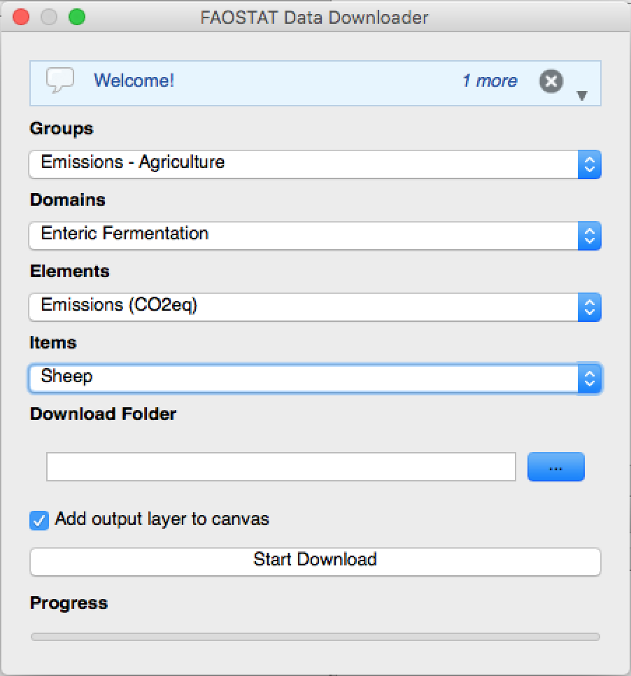
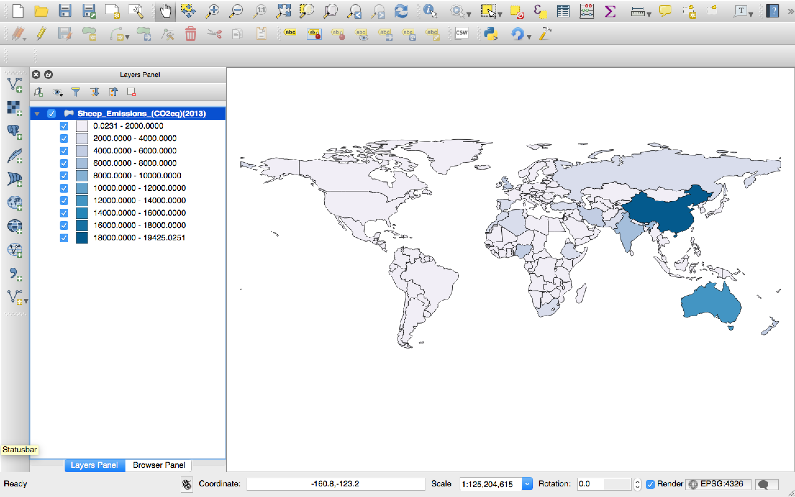

[](http://doge.mit-license.org)
[](https://github.com/auchenberg/volkswagen)
<a href='https://pledgie.com/campaigns/30659'></a>

# FAOSTAT Data Downloader for QGIS
Download FAOSTAT statistics and create thematic maps.

|Plugin|Output|
|------|------|
|||

About FAOSTAT
=============
[FAOSTAT](http://faostat3.fao.org/) is maintained by the [Statistics Division](http://www.fao.org/statistics) of the [Food and Agricultural Organization of the United Nations](http://www.fao.org/). In working directly with the countries, the Statistics Division supports the development of national statistical strategies, the strengthening of Institution and technical capacities, and the improvement of statistical systems.

The FAOSTAT system is one of FAO’s most important corporate systems. It is a major component of FAO’s information systems, contributing to the organization’s strategic objective of collecting, analyzing, interpreting, and disseminating information relating to nutrition, food and agriculture for development and the fight against global hunger and malnutrition.

> Food and Agriculture Organization Corporate Statistical Database. (2015, January 22). In Wikipedia, The Free Encyclopedia. Retrieved 16:23, August 30, 2015, from [Wikipedia](https://en.wikipedia.org/w/index.php?title=Food_and_Agriculture_Organization_Corporate_Statistical_Database&oldid=643626002)

# FAOSTAT API
This plugin uses the official [FAOSTAT API](http://faostat.github.io/faostat-api/) to retireve official FAO data and create thematic maps out of it.

# Data Availability

FAOSTAT data spans from 1961 to 2014 and it is updated yearly.

# Installation

To install the plugin go to the *Plugins* menu and open *Manage and Install Plugins…*. Then search for *FAOSTAT* and install the plugin. When the installation is complete you should find a new icon in the toolbar, or you can access it from *Plugins > Download Data > FAOSTAT Data Downloader*.

# User Interface

The user interface allows the user to select the parameters to filter FAOSTAT data. The database is organized in ```groups``` (*e.g. Production*) and ```domains``` (*e.g. Crops*). Each domain then contains ```elements``` (*e.g. Area Harvested*) and ```items``` (*e.g. Wheat*). The plugin applies these filters and downloads data for all the available years and countries.

* **Groups:** list of available FAOSTAT groups
* **Domains:** list of available FAOSTAT domains for the selected group
* **Elements:** list of available FAOSTAT elements for the selected domain
* **Items:** list of available FAOSTAT items for the selected domain
* **Download Folder:** folder used to store the output layer
* **Add output layer to the canvas:** flag that determines whether the output layer must be added to the map or not
* **Progress:** progress bar, updated for each year that is added to the output layer

# Output

Once the data is downloaded the plugin clones the base layer and add, to its attributes table, a column of values for each available year. The output layer is then stored in a folder system that follows the FAOSTAT structure. For instance, if you download data from the Production group (*code: Q*) and the Crops domain (*code: QC*), the final output will be stored in ``[DOWNLOAD_FOLDER]/Q/QC/``. The layer is then added to the map If the *Add output layer to the canvas* flag has been selected. The layer shows, by default, the latest available year, and it is styled with 11 *Pretty* intervals and the *PuBu* gradient. 

# Credits

The base layer is a modified version of the [Natural Earth 1:110m Cultural Vectors](http://www.naturalearthdata.com/downloads/110m-cultural-vectors/) that has been edited to contain an extra column with the FAOSTAT country codes.

# Multilanguage

The plugin is currently available in English and Italian. A project on [Transifex](https://www.transifex.com/) has been added at [this URL](https://www.transifex.com/geobricks/faostat-data-downloader/dashboard/). Anyone can contribute to add more languages. Considering the FAOSTAT data is also available in French and Spanish, it would be great to have these languages in place.
# Developed with

